# Procesverslag
**Auteur:** Lisa Oude Elferink (500808354)

## Bronnenlijst
1. [A Complete Guide To Flexbox](https://css-tricks.com/snippets/css/a-guide-to-flexbox/).
2. [DigiD website](https://www.digid.nl/).

## Eindgesprek (week 7/8)
### Stand van zaken
**Dit ging goed:** Het schalen van de pagina van klein naar grotere schermen ging heel goed! Ik hoefde maar een aantal dingen aan te passen bij de grotere schermen, de rest ging haast vanzelf!

**Dit was lastig:** Het was even lastig om mijn hamburger menu in elkaar te zetten en vervolgens weer 'normaal' te krijgen voor een groot scherm. Ik had dit expres als voor het laatste bewaard zodat ik verder gewoon lekker verder kon gaan. Toen ik het eenmaal door had ging het eigenlijk heel goed!

**Screenshot(s):** 
### Mobiel pagina 1
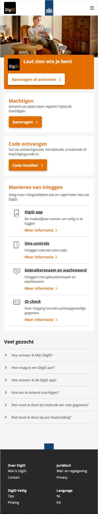

### Mobiel pagina 2
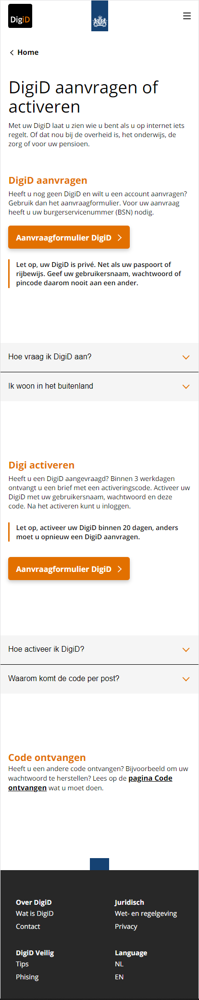

### iPad formaat pagina 1
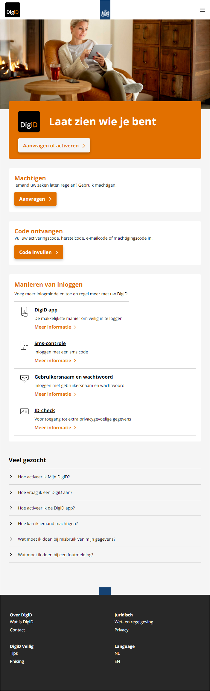

### iPad formaat pagina 2
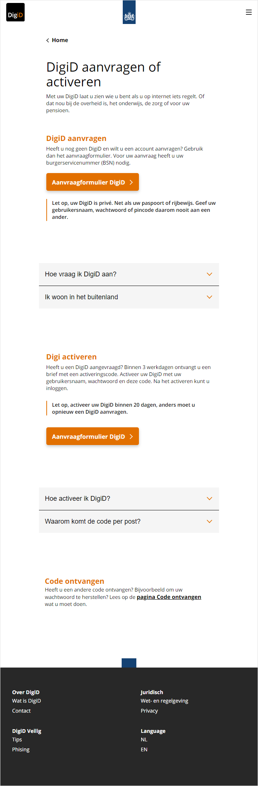

### Groot scherm pagina 1
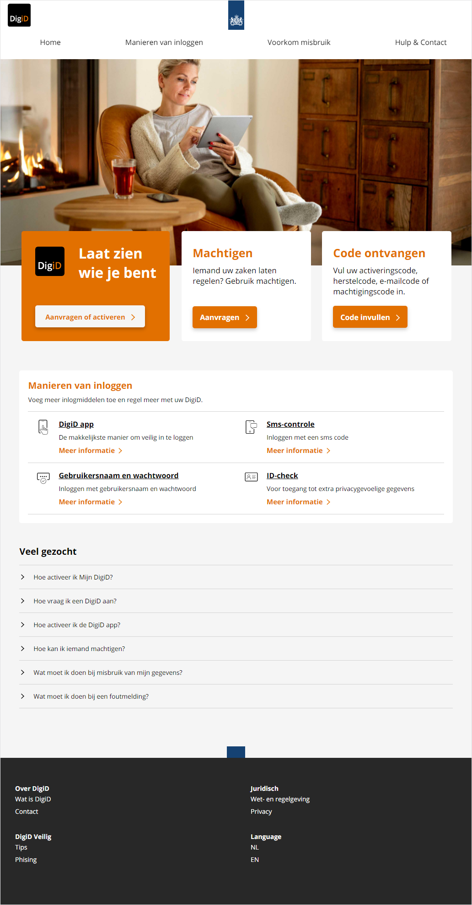

### Groot scherm pagina 2
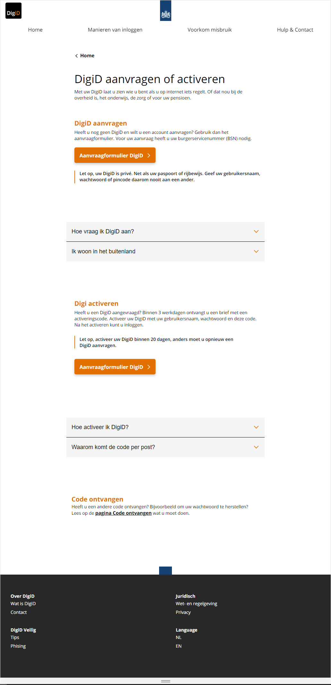

### Groter scherm pagina 1
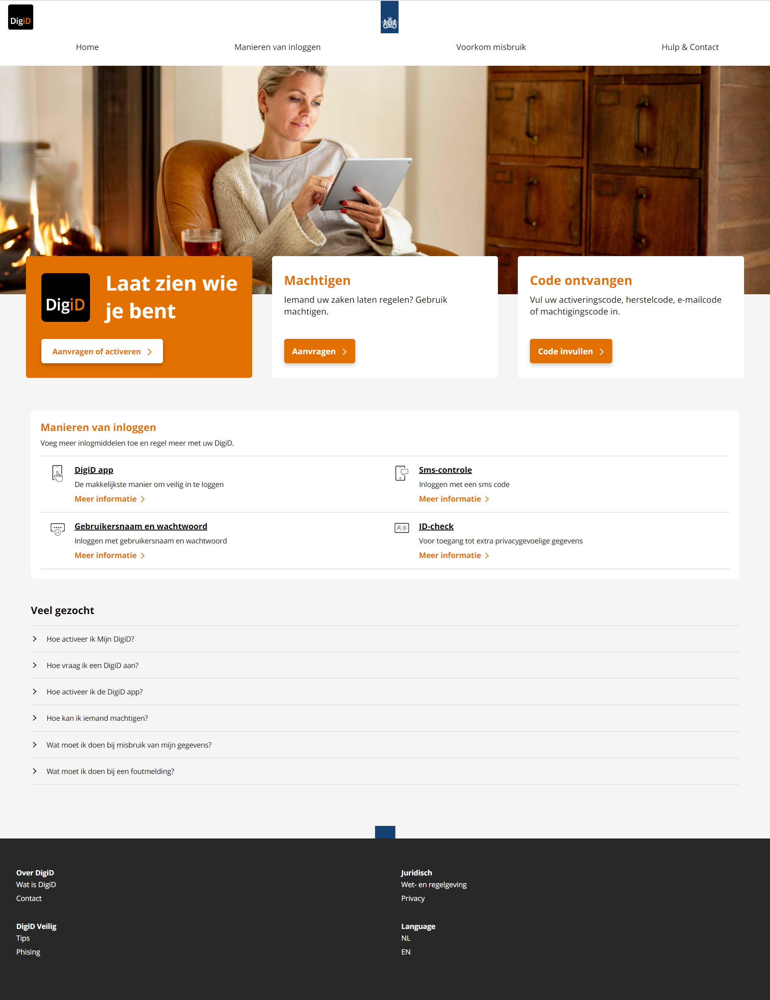

### Groter scherm pagina 2
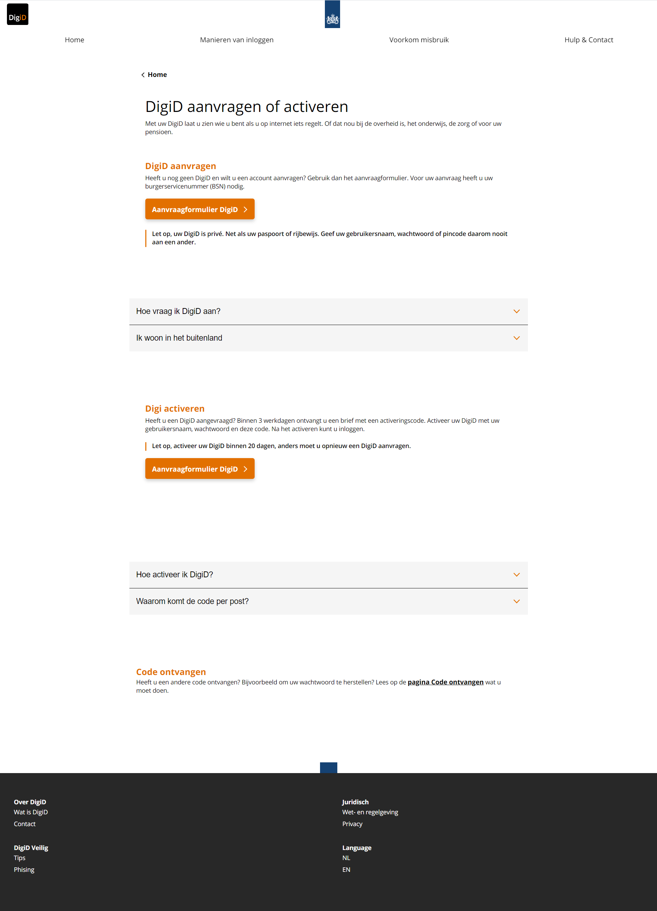

## Voortgang 3 (week 6)
Deze week heeft mijn voortgangsgesprek maar heel kort geduurd, aangezien ik zo snel mogelijk mijn bed in wilde duiken vanwege mijn Corona verschijnselen. En ja hoor, de test liet me een paar dagen later weten dat het inderdaad Corona was. Ontzettend leuk, ook weer meegemaakt.

Ik was tot aan deze voortgang verder gegaan met het zorgen voor een mooie scaling op mijn eerste pagina en was begonnen aan de CSS voor mijn tweede pagina.

### Stand van zaken
**Dit ging goed:** Veel! Alles lukte me goed, en dat wat niet lukte heb ik gevraagd en op die manier goed kunnen oplossen.

**Dit was lastig:** Ik heb het momenteel ook heel druk met mijn andere vakken, waardoor ik front-end wederom weer klein beetje links heb laten liggen. Ook de Corona hielp niet echt :').

### Agenda voor meeting
Code snel doorlopen en feedback opschrijven. Zelf geen vragen.

### Verslag van meeting
Het gaat goed! Lekker zo doorgaan. Ik hoef nu eigenlijk alleen nog de tweede pagina te stylen, en hier moet ik vooral niet te veel tijd in gaan steken. Verder kan ik nog kijken of het leuk is om iets te doen met de focus states van buttons en eens te kijken naar CSS specificity. Als laatste hoef ik eigenlijk alleen maar het beoordelingsformulier ernaast te leggen en te kijken of alles er daadwerkelijk in zit. 

## Voortgang 2 (week 5)
Ik ben voornamelijk bezig geweest met het werken aan de responsiviteit van mijn eerste pagina. Ik heb nu alles netjes geschaalt tot 1000px vw, vanaf daar wordt het lastiger omdat er dan het een ander ander verandert qua indeling.

Ik heb de HTML van mijn tweede pagina er volledig in staan, maar vind het lastig hoe ik deze gemakkelijk kan gaan stylen zonder de gehele styling van de eerste pagina over te nemen. Ik denk zelf aan het geven van een class aan de main van de tweede pagina, maar weet niet of dit een goede oplossing is of een gevalletje ductape erop :').

### Stand van zaken
**Dit ging goed:** Experimenteren ging goed! Ik heb veel geprobeerd en ben daardoor verder gekomen.

**Dit was lastig:** Ik heb het momenteel ook heel druk met mijn andere vakken, waardoor ik front-end een kleeiiin beetje links heb laten liggen.

### Agenda voor meeting
Bekijken website, doorlopen code. 
Vragen hoe ik de eerste 3 sections naast elkaar krijg vanaf 1000px vw.
Vragen hoe het beste de tweede pagina te stylen.
Verder geen vragen.

### Verslag van meeting
Ik ben goed bezig. Monika (vervanging) kon mijn vragen niet beantwoorden dus ik ga zelf Google verder afstruinen en eventueel Jo-Ann en Romy raadplegen.

## Voortgang 1 (week 3)
Hier de screenshot van waar ik tot nu toe ben gekomen! Ik heb de eerste pagina voor mobiel zo goed als af. Hier en daar nog een dingetje fixen voor kleiner/groter scherm, maar verder af.
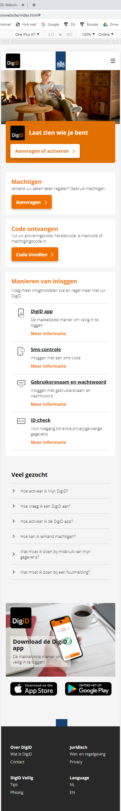

### Stand van zaken
**Dit ging goed:** Heel veel! Ik kon mezelf goed aan het werk zetten en wist eigenlijk heel goed wat ik aan het doen was.

**Dit was lastig:** Mijn footer kwam bovenaan te pagina, dus die heeft nu een top van 145 hahaha.

### Agenda voor meeting
Bekijken website, doorlopen code. 
Vragen waarom de footer bovenaan kwam, hoe te fixen. 
Verder geen vragen.

### Verslag van meeting
Ik ben goed op weg. Mijn code ziet er netjes uit en ik heb geen bijzondere op- of aanmerkingen gehad. Wel heb ik antwoord op mijn vraag over de footer, en is dit probleem opgelost!

## Intake (week 1)

**Je startniveau:** Ik bevind me momenteel op de **rode piste**. Vorig jaar heb ik het vak niet gehaald, maar heb ik vervolgens wel gekozen voor front-end voor designers, wat me goed af is gegaan. Hierdoor heb ik nu veel meer kennis over code dan voorheen. 

**Je focus:** Ik ga voor het geheel responsive maken van de website.

**Je opdracht:** [Ik ga de DigiD website nabouwen.](https://www.digid.nl/)

**Screenshot(s):**
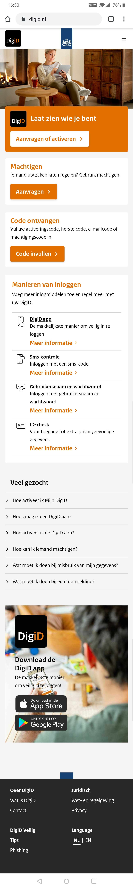
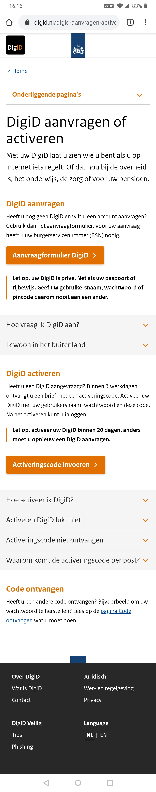

**Breakdown-schets(en):**

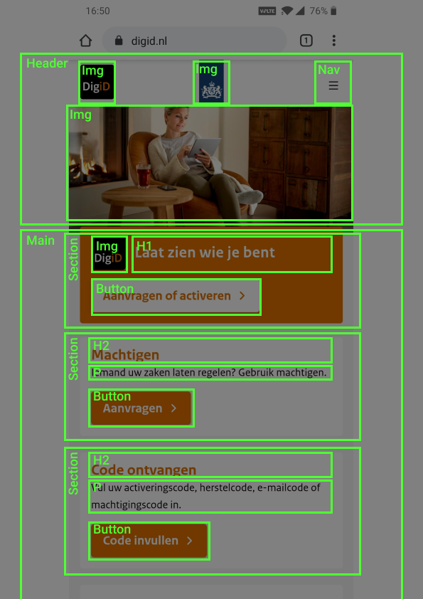
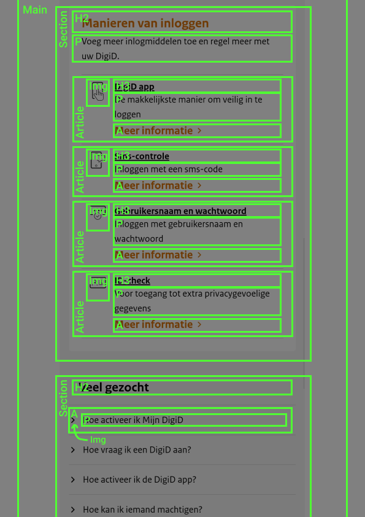
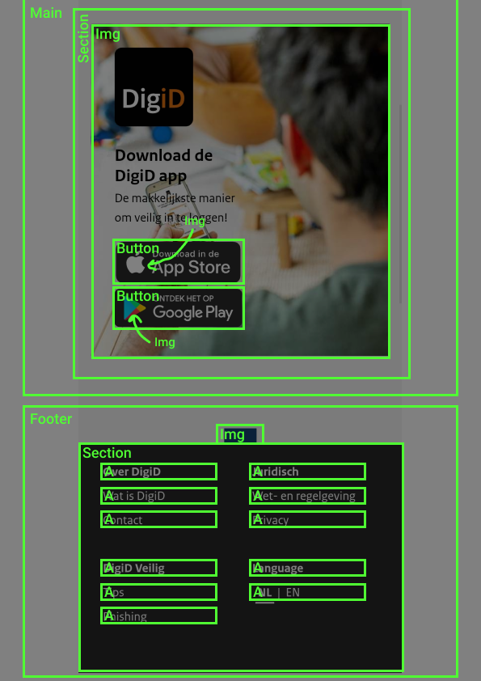
